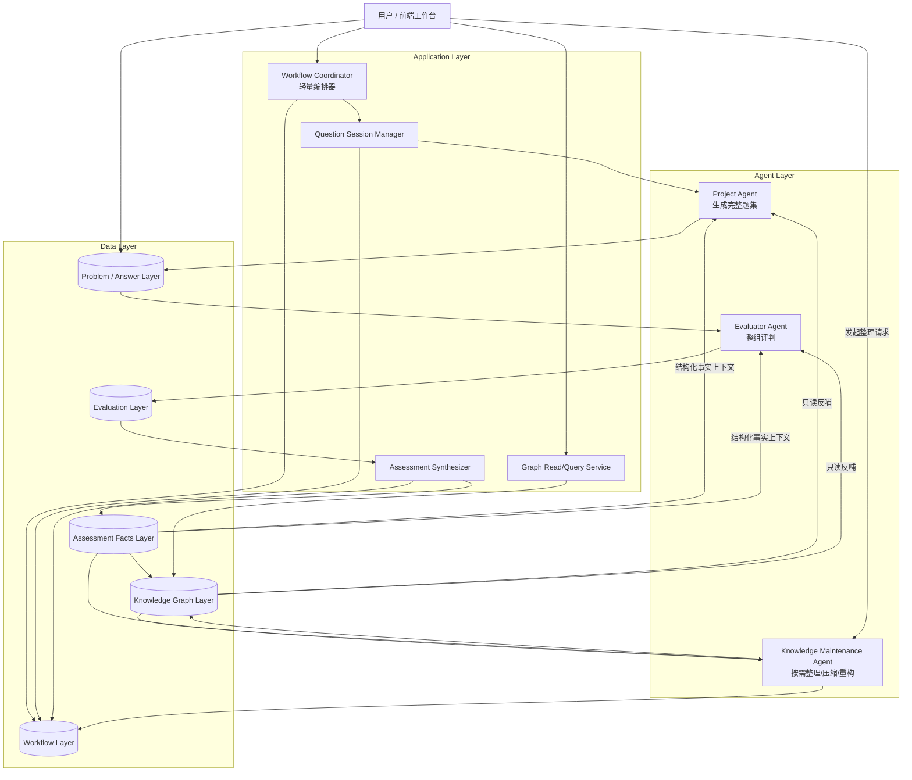
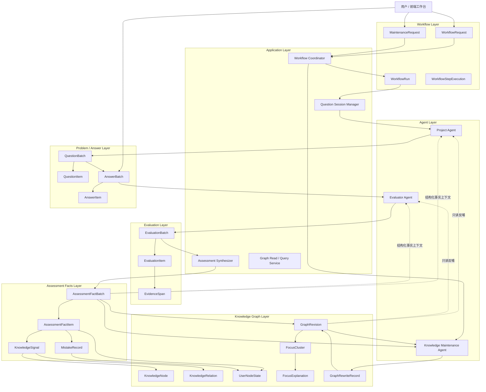

# 终态业务架构设计草案

> 当前文档不是实现计划，也不是当前代码结构说明，而是项目终态业务架构的设计草案。它的职责是冻结终态主流程、agent 分工、数据库数据分层与单向数据流，为后续对象编排和正式架构图细化提供稳定基线。

## 1. 当前阶段定位

### 当前阶段目标
1. 把终态业务主轴、主流程、agent 边界和数据库分层从对话判断压成正式文档。
2. 让后续数据库对象编排不再依赖口头记忆。
3. 避免在数据结构尚未收口前把终态详细实现图画死。

### 当前阶段产物
1. 一版终态业务高层架构图。
2. 一版终态 agent 分工说明。
3. 一版数据库五层分层与单向数据流规则。

### 当前阶段退出条件
1. 项目终态的第一主轴、问题进入机制、工作流主流程已经明确。
2. Project Agent、Evaluator Agent、Knowledge Maintenance Agent 的职责边界已经明确。
3. 数据层的最小分层与流向已经明确。

---

## 2. 终态产品定义

终态不是一个单纯的知识图页面，也不是一个刷题工具，而是：

`一个围绕真实项目推进工作的长期工作台。用户在前端显式发起阶段性工作流，系统基于当前项目和阶段生成整组问题，用户整组作答后由评判 agent 整体评判，再将结构化评判结果沉淀为长期事实，并在用户主动要求时由知识维护 agent 整理、压缩、重构为可交互的星图知识网络。`

核心目标有两个主次分明的方向：
1. 第一主轴：帮助继续推进当前真实项目。
2. 第二主轴：顺手沉淀长期知识资产。

面试训练能力是重要并行能力，但不是系统第一入口。

---

## 3. 终态业务总原则

### 3.1 用户显式触发，而不是系统默认乱触发
终态工作流默认从用户在前端界面的主动申请开始。系统可以发现值得整理或复盘的内容，但不应默认强行打断用户。

### 3.2 项目问题优先于独立刷题
终态默认优先服务真实项目推进中的真实问题。用户主动提问和系统主动发现的问题都存在，但优先级低于项目推进中被动触发的问题。

### 3.3 一次生成整组问题，一次整组作答，再整体评判
终态不采用逐题动态重规划作为主模式。更优的默认主流程是：
1. Project Agent 一次性生成一小组问题。
2. 用户一次性完成整组作答。
3. Evaluator Agent 整体评判。
4. 系统再做结构化沉淀与知识整理。

### 3.4 数据库驱动工作流，而不是复杂实时路由
终态更像“数据库驱动的多阶段工作台”，而不是复杂实时路由系统。
各行为之间通过稳定数据库对象衔接：
1. 题集落库。
2. 回答落库。
3. 评判结果落库。
4. Assessment facts 落库。
5. 知识图按需整理重构。

### 3.5 历史层不可被知识图反向污染
Knowledge Graph 是派生层，不是更高级的真相层。它可以只读反哺后续工作流，但不能反向改写 Problem/Answer、Evaluation、Assessment Facts 历史层。

---

## 4. 终态高层架构图

---

## 4.1 第二版正式架构图（带对象宿主）

第一版高层架构图主要冻结主流程、agent 分工和五层数据分层。  
第二版正式架构图继续把“每层的核心对象宿主”显式挂进来，但仍然不进入表级 schema。

### 这张图相对第一版新增的冻结点
1. `Assessment Synthesizer` 不再只是概念层，而是和 `EvaluationBatch -> AssessmentFactBatch` 的对象宿主对应起来。
2. `Knowledge Maintenance Agent` 不再只读“抽象 graph”，而是明确读取：
   - `AssessmentFactBatch`
   - `GraphRevision`
   并输出：
   - `GraphRewriteRecord`
   - 新的 `GraphRevision`
3. `Knowledge Graph` 对 `Project Agent / Evaluator Agent` 的反馈被明确限制为：
   - `GraphRevision` 的只读反哺
   - 不反向污染历史层
4. 五层数据库已经不只是分层概念，而是开始拥有稳定对象宿主。

### 当前仍然不在这张图里冻结的内容
1. 表级 schema
2. SQL 索引策略
3. 前端 DTO
4. 星图布局坐标与动画模型

---

## 5. 终态主流程

### 5.1 用户发起工作流
用户在前端选择：
1. 项目
2. 当前阶段
3. 训练/推进/整理请求

然后显式发起一次阶段性工作流。

### 5.2 Project Agent 生成完整题集
Project Agent 基于：
1. 当前项目上下文
2. 当前阶段目标
3. Assessment facts 提供的结构化事实上下文
4. Knowledge Graph 提供的只读知识上下文

一次性生成完整题集。

### 5.3 用户整组作答
用户完整答完这一小组问题。这里默认不是逐题即时跳转，而是一轮完整答题。

### 5.4 Evaluator Agent 整体评判
Evaluator Agent 读取：
1. 问题集
2. 用户整组回答
3. 当前项目与阶段上下文
4. 结构化 pre-pass
5. 必要的只读知识上下文

然后输出整组评判结果。

### 5.5 Assessment Synthesizer 结构化落盘
系统把评判结果整理成：
1. assessment facts
2. mistakes
3. knowledge signals
4. support signals
5. 后续建议

这是评判层与知识图投影层之间的关键中间层。

### 5.6 用户按需发起知识整理
当用户主动要求整理、压缩、重构时，Knowledge Maintenance Agent 读取：
1. Assessment Facts Layer
2. 当前 Knowledge Graph Layer
3. 用户指定的整理范围和强度

然后执行整理重构。

### 5.7 星图形成并反哺后续工作流
整理后的 Knowledge Graph：
1. 供前端星图展示
2. 为 Project Agent 提供只读知识上下文
3. 为 Evaluator Agent 提供只读知识上下文

它参与后续工作流，但不能反向污染历史层。

---

## 6. Agent 分工

### 6.1 Project Agent
职责：
1. 读取项目上下文。
2. 生成完整题集。
3. 设计每轮问题意图和覆盖范围。
4. 服务“继续推进当前项目”的第一主轴。

不负责：
1. 最终整组评判。
2. 直接维护知识图。

### 6.2 Evaluator Agent
职责：
1. 整组评判用户回答。
2. 输出 rubric 结果、reasoned summary、gaps、follow-up 建议。
3. 服务“判得准”的高语义评判职责。

不负责：
1. 出题。
2. 直接输出最终 KnowledgeNode/KnowledgeRelation 真相。
3. 直接重写知识图。

### 6.3 Knowledge Maintenance Agent
职责：
1. 节点去重。
2. 关系重构。
3. 抽象层提升或降级建议。
4. 星图压缩、重组和重排。

触发方式：
1. 默认按需触发。
2. 由用户主动发起整理请求后工作。

### 6.4 Workflow Coordinator
职责：
1. 串流程。
2. 记录当前状态。
3. 调用相应 agent。
4. 驱动写库。

它不是高语义 agent，只是薄执行层。

---

## 7. 终态数据库五层分层

### 7.1 Workflow Layer
作用：
回答“现在跑到了哪一步”。

包括：
1. 工作流申请
2. 当前批次
3. 工作流状态
4. 执行记录
5. 整理请求

### 7.2 Problem / Answer Layer
作用：
回答“这一轮到底问了什么、答了什么”。

包括：
1. QuestionBatch
2. 题目
3. 用户回答
4. 分题回答
5. 上下文快照

### 7.3 Evaluation Layer
作用：
回答“系统怎么看这轮回答”。

包括：
1. rubric scores
2. reasoned summary
3. evidence spans
4. diagnosed gaps
5. follow-up suggestions
6. confidence

### 7.4 Assessment Facts Layer
作用：
回答“哪些评判结果变成了稳定事实输入”。

包括：
1. assessment facts
2. mistakes
3. knowledge signals
4. support signals
5. dimension hits
6. support basis tags

### 7.5 Knowledge Graph Layer
作用：
回答“目前整理后的知识网络长什么样”。

包括：
1. KnowledgeNode
2. KnowledgeRelation
3. UserNodeState
4. FocusCluster
5. FocusExplanation
6. graph rewrite result / graph revision

---

## 8. 数据演化策略

### 8.1 以追加为主的历史层
以下层默认应以追加为主，不直接覆盖历史：
1. Problem / Answer Layer
2. Evaluation Layer
3. Assessment Facts Layer

理由：
1. 题与答是历史事实。
2. 评判结果是某次历史判断。
3. facts 是某次评判整理出的结构化事实快照。

### 8.2 可变但可追踪的当前层
以下层允许重写，但必须保留过程痕迹、版本或提案记录：
1. Workflow Layer
2. Knowledge Graph Layer

理由：
1. Workflow 回答当前状态，天然可变。
2. Knowledge Graph 是派生层，终态一定需要整理、压缩、重构。

一句话策略：

`历史层追加，当前层可变，知识图层可重构。`

---

## 9. 数据流方向

终态数据流以单向为主：

1. `Problem / Answer -> Evaluation`
2. `Evaluation -> Assessment Facts`
3. `Assessment Facts -> Knowledge Graph`

Knowledge Graph 的唯一反哺形式是：
1. 对 Project Agent 提供只读知识上下文。
2. 对 Evaluator Agent 提供只读知识上下文。

禁止：
1. 用 Knowledge Graph 回写 Problem / Answer。
2. 用 Knowledge Graph 回写 Evaluation。
3. 用整理后的节点与关系反向覆盖 Assessment Facts 历史层。

---

## 10. 终态里适合提前备宿主的对象

即使当前不实现终态 agent，也建议提前为这些对象留宿主：

1. `QuestionBatch`
2. `EvaluationResult`
3. `AssessmentFact`
4. `KnowledgeSignal`
5. `MaintenanceRequest`
6. `GraphRewriteProposal` 或等价宿主

这些对象的存在，是为了避免后面 agent 真正接入时，只能读写松散 payload。

---

## 11. 当前冻结结论

### 正确点
1. 终态主流程已经从“复杂实时路由”校准为“数据库驱动的多阶段工作台”。
2. 三类核心 agent 的边界已经清楚。
3. Assessment Synthesizer 作为中间层是必要的。
4. 数据库五层分层与单向流向已经清楚。

### 当前不做
1. 不把这份文档直接翻译成表级 schema。
2. 不在这里定义具体 API。
3. 不在这里定义当前代码实现顺序。

### 下一步
基于这份终态业务架构草案，继续收：

`数据库五层中的核心对象编排`

也就是：
1. 每层最少有哪些核心对象
2. 对象之间最小如何引用
3. 哪些对象是 append-only，哪些对象是 current state

---

## 12. 终态数据库核心对象编排总览

这一节开始从“数据库五层分层”继续下钻到“每层最少有哪些核心对象”。  
当前目标仍然不是表级 schema，而是先冻结对象宿主、对象边界和最小引用关系。

### 12.1 总体原则
1. 先定对象，再定表。
2. 先定对象边界，再定字段细节。
3. 先区分历史层对象与当前状态对象，再讨论读写策略。
4. Knowledge Graph Layer 只消费上游 facts/signals，不反向回写历史层。

### 12.2 五层对象总表
1. `Workflow Layer`
   - `WorkflowRequest`
   - `WorkflowRun`
   - `WorkflowStepExecution`
   - `MaintenanceRequest`
2. `Problem / Answer Layer`
   - `QuestionBatch`
   - `QuestionItem`
   - `AnswerBatch`
   - `AnswerItem`
3. `Evaluation Layer`
   - `EvaluationBatch`
   - `EvaluationItem`
   - `EvidenceSpan`
4. `Assessment Facts Layer`
   - `AssessmentFactBatch`
   - `AssessmentFactItem`
   - `MistakeRecord`
   - `KnowledgeSignal`
5. `Knowledge Graph Layer`
   - `GraphRevision`
   - `KnowledgeNode`
   - `KnowledgeRelation`
   - `UserNodeState`
   - `FocusCluster`
   - `FocusExplanation`
   - `GraphRewriteRecord`

---

## 13. Workflow Layer 核心对象

### 13.1 WorkflowRequest
作用：用户显式发起的一次工作流请求。  
它回答“用户想让系统开始什么工作流”，不是运行实例，也不是步骤日志。

最小字段：
1. `request_id`
2. `request_type`
3. `project_id`
4. `stage_id`
5. `requested_by`
6. `source`
7. `request_payload`
8. `status`
9. `created_at`

### 13.2 WorkflowRun
作用：系统实际执行的一次运行实例。  
它回答“系统真的跑了哪一次”，和用户意图对象分离。

最小字段：
1. `run_id`
2. `request_id`
3. `run_type`
4. `status`
5. `started_at`
6. `finished_at`
7. `trigger_context`
8. `agent_versions`
9. `result_summary`

可选：
1. `supersedes_run_id`

### 13.3 WorkflowStepExecution
作用：运行中的关键步骤记录。  
粒度冻结为“业务关键步骤级”，而不是全量 event sourcing 或 agent message log。

推荐 step type 示例：
1. `generate_question_batch`
2. `collect_answers`
3. `evaluate_batch`
4. `synthesize_assessment`
5. `project_knowledge_signals`
6. `run_graph_maintenance`

最小字段：
1. `step_execution_id`
2. `run_id`
3. `step_type`
4. `status`
5. `started_at`
6. `finished_at`
7. `actor`
8. `input_ref`
9. `output_ref`
10. `step_summary`
11. `error_code`

### 13.4 MaintenanceRequest
作用：知识整理/压缩/重构的专用请求。  
它不只是普通 request 的 payload 子块，因为终态里它的语义会越来越重。

最小字段：
1. `maintenance_request_id`
2. `workflow_request_id`
3. `requested_by`
4. `scope_type`
5. `scope_ref`
6. `maintenance_mode`
7. `intensity`
8. `request_notes`
9. `proposal_required`
10. `status`
11. `created_at`

可选：
1. `supersedes_maintenance_request_id`

### 13.5 Layer 内最小引用关系
1. `WorkflowRequest -> WorkflowRun[]`
2. `WorkflowRun -> WorkflowStepExecution[]`
3. `WorkflowRequest -> MaintenanceRequest?`
4. `MaintenanceRequest -> WorkflowRun[]`

---

## 14. Problem / Answer Layer 核心对象

### 14.1 QuestionBatch
作用：一次阶段性完整题集。  
它回答“这一轮问了什么集合、服务什么目标”。

最小字段：
1. `question_batch_id`
2. `workflow_run_id`
3. `project_id`
4. `stage_id`
5. `generated_by`
6. `source`
7. `batch_goal`
8. `question_ids`
9. `entry_question_id`
10. `context_snapshot`
11. `status`
12. `created_at`

### 14.2 QuestionItem
作用：题集中的单题。  
它回答“这道题是什么、为什么问、准备看什么”。

最小字段：
1. `question_id`
2. `question_batch_id`
3. `question_type`
4. `prompt`
5. `intent`
6. `target_dimensions`
7. `related_context_refs`
8. `difficulty_level`
9. `order_index`
10. `status`
11. `created_at`

可选：
1. `follow_up_hint`

### 14.3 AnswerBatch
作用：用户对整组题的一次完整提交。  
它回答“这一轮整组回答作为一次提交，整体发生了什么”。

最小字段：
1. `answer_batch_id`
2. `question_batch_id`
3. `workflow_run_id`
4. `submitted_by`
5. `submission_mode`
6. `answer_item_ids`
7. `completion_status`
8. `submission_notes`
9. `submitted_at`
10. `status`

可选：
1. `context_snapshot`

### 14.4 AnswerItem
作用：某一道题的原始回答事实。  
它回答“某一题具体答了什么”，不承载评判结果。

最小字段：
1. `answer_item_id`
2. `answer_batch_id`
3. `question_id`
4. `answered_by`
5. `answer_text`
6. `answer_format`
7. `order_index`
8. `answered_at`
9. `status`

可选：
1. `revision_of_answer_item_id`
2. `local_notes`
3. `context_ref`

### 14.5 Layer 内最小引用关系
1. `QuestionBatch -> QuestionItem[]`
2. `QuestionBatch -> AnswerBatch[]`
3. `QuestionItem -> AnswerItem[]`
4. `AnswerBatch -> AnswerItem[]`

---

## 15. Evaluation Layer 核心对象

### 15.1 EvaluationBatch
作用：对整组回答的一次整体评判。  
它回答“系统对这一整组回答的整体判断是什么”。

最小字段：
1. `evaluation_batch_id`
2. `answer_batch_id`
3. `workflow_run_id`
4. `evaluated_by`
5. `evaluator_version`
6. `rubric_scores`
7. `reasoned_summary`
8. `diagnosed_gaps`
9. `follow_up_suggestions`
10. `confidence`
11. `evaluated_at`

可选：
1. `status`
2. `supersedes_evaluation_batch_id`

### 15.2 EvaluationItem
作用：对单题回答的一次评判。  
它回答“系统对某一道题具体怎么看”。

最小字段：
1. `evaluation_item_id`
2. `evaluation_batch_id`
3. `question_id`
4. `answer_item_id`
5. `rubric_scores`
6. `reasoned_summary`
7. `diagnosed_gaps`
8. `follow_up_suggestions`
9. `confidence`
10. `status`
11. `evaluated_at`

可选：
1. `local_verdict`

### 15.3 EvidenceSpan
作用：评判依据锚点。  
它回答“凭什么这么评”，不直接承载 facts 或 graph 结果。

最小字段：
1. `evidence_span_id`
2. `evaluation_item_id`
3. `answer_item_id`
4. `span_type`
5. `content`
6. `start_offset`
7. `end_offset`
8. `supports_dimension`
9. `why_it_matters`
10. `created_at`

可选：
1. `polarity`
2. `confidence`

### 15.4 Layer 内最小引用关系
1. `AnswerBatch -> EvaluationBatch`
2. `AnswerItem -> EvaluationItem`
3. `EvaluationBatch -> EvaluationItem[]`
4. `EvaluationItem -> EvidenceSpan[]`

---

## 16. Assessment Facts Layer 核心对象

### 16.1 AssessmentFactBatch
作用：一次整组评判经过 synthesis 后形成的一整批结构化事实。

最小字段：
1. `assessment_fact_batch_id`
2. `evaluation_batch_id`
3. `workflow_run_id`
4. `synthesized_by`
5. `synthesizer_version`
6. `fact_item_ids`
7. `mistake_record_ids`
8. `knowledge_signal_ids`
9. `batch_summary`
10. `status`
11. `synthesized_at`

可选：
1. `supersedes_assessment_fact_batch_id`
2. `scope_summary`

### 16.2 AssessmentFactItem
作用：单条长期结构化事实。  
它是 facts 层的基本粒度，不直接等于 graph node。

最小字段：
1. `assessment_fact_item_id`
2. `assessment_fact_batch_id`
3. `source_evaluation_item_id`
4. `fact_type`
5. `topic_key`
6. `title`
7. `description`
8. `dimension_refs`
9. `evidence_span_ids`
10. `confidence`
11. `status`
12. `created_at`

可选：
1. `supersedes_assessment_fact_item_id`
2. `scope_ref`

### 16.3 MistakeRecord
作用：错题/误区的长期业务对象。  
它回答“这次具体暴露了哪类错误”，可长期追踪与重复出现。

最小字段：
1. `mistake_record_id`
2. `assessment_fact_item_id`
3. `source_evaluation_item_id`
4. `question_id`
5. `answer_item_id`
6. `mistake_type`
7. `topic_key`
8. `title`
9. `description`
10. `severity`
11. `status`
12. `created_at`

可选：
1. `evidence_span_ids`
2. `resolved_at`
3. `supersedes_mistake_record_id`
4. `repeat_count`

### 16.4 KnowledgeSignal
作用：事实层到图谱层之间的投影桥梁。  
它回答“哪些事实值得投影成知识结构”。

最小字段：
1. `knowledge_signal_id`
2. `assessment_fact_item_id`
3. `source_evaluation_item_id`
4. `signal_type`
5. `target_kind`
6. `topic_key`
7. `label`
8. `description`
9. `signal_payload`
10. `evidence_span_ids`
11. `confidence`
12. `status`
13. `created_at`

可选：
1. `projection_hint`
2. `supersedes_knowledge_signal_id`
3. `scope_ref`

### 16.5 Layer 内最小引用关系
1. `EvaluationBatch -> AssessmentFactBatch`
2. `AssessmentFactBatch -> AssessmentFactItem[]`
3. `AssessmentFactItem -> MistakeRecord[]`
4. `AssessmentFactItem -> KnowledgeSignal[]`

---

## 17. Knowledge Graph Layer 核心对象

### 17.1 GraphRevision
作用：图谱当前版本/某次重构结果的宿主。  
它回答“当前是哪一版图”。

最小字段：
1. `graph_revision_id`
2. `project_id`
3. `scope_type`
4. `scope_ref`
5. `revision_type`
6. `based_on_revision_id`
7. `source_fact_batch_ids`
8. `status`
9. `revision_summary`
10. `created_by`
11. `created_at`
12. `activated_at`

可选：
1. `node_count`
2. `relation_count`
3. `focus_cluster_count`

### 17.2 KnowledgeNode
作用：长期知识资产中的节点本体。  
它回答“图里有什么长期知识对象”。

最小字段：
1. `knowledge_node_id`
2. `graph_revision_id`
3. `topic_key`
4. `label`
5. `node_type`
6. `description`
7. `source_signal_ids`
8. `supporting_fact_ids`
9. `status`
10. `created_by`
11. `created_at`
12. `updated_at`

可选：
1. `canonical_key`
2. `abstraction_level`
3. `scope_ref`

### 17.3 KnowledgeRelation
作用：节点之间的结构关系本体。  
它回答“这些节点怎么连”。

最小字段：
1. `knowledge_relation_id`
2. `graph_revision_id`
3. `from_node_id`
4. `to_node_id`
5. `relation_type`
6. `directionality`
7. `description`
8. `source_signal_ids`
9. `supporting_fact_ids`
10. `confidence`
11. `status`
12. `created_at`
13. `updated_at`

可选：
1. `canonical_key`
2. `weight`
3. `rewrite_record_id`

### 17.4 UserNodeState
作用：用户相对某个节点的当前状态。  
它回答“这个用户当前对这个节点掌握如何”。

最小字段：
1. `user_node_state_id`
2. `graph_revision_id`
3. `project_id`
4. `knowledge_node_id`
5. `user_id`
6. `mastery_level`
7. `review_need`
8. `signal_strength`
9. `last_evidence_at`
10. `supporting_fact_ids`
11. `supporting_mistake_record_ids`
12. `status`
13. `updated_at`

可选：
1. `first_observed_at`
2. `confidence`
3. `state_summary`

### 17.5 FocusCluster
作用：当前优先看的图谱片区组织对象。  
它回答“当前该先看哪一片图”。

最小字段：
1. `focus_cluster_id`
2. `graph_revision_id`
3. `project_id`
4. `center_node_id`
5. `member_node_ids`
6. `member_relation_ids`
7. `cluster_type`
8. `priority_score`
9. `reason_codes`
10. `scope_ref`
11. `status`
12. `created_at`
13. `updated_at`

可选：
1. `pinned`
2. `source_signal_ids`
3. `cluster_summary`

### 17.6 FocusExplanation
作用：`why it matters` 的稳定宿主。  
它回答“为什么这个焦点簇当前重要”。

最小字段：
1. `focus_explanation_id`
2. `graph_revision_id`
3. `focus_cluster_id`
4. `subject_kind`
5. `summary`
6. `reason_codes`
7. `generated_by`
8. `generator_version`
9. `status`
10. `generated_at`
11. `updated_at`

可选：
1. `confidence`
2. `supersedes_focus_explanation_id`
3. `evidence_ref_ids`

### 17.7 GraphRewriteRecord
作用：一次按需整理/压缩/重构的治理记录。  
它回答“这次实际上怎么改了、为什么改”。

最小字段：
1. `graph_rewrite_record_id`
2. `maintenance_request_id`
3. `workflow_run_id`
4. `source_graph_revision_id`
5. `result_graph_revision_id`
6. `rewritten_by`
7. `rewriter_version`
8. `rewrite_mode`
9. `rewrite_summary`
10. `change_summary`
11. `status`
12. `started_at`
13. `finished_at`

可选：
1. `proposal_ref`
2. `risk_level`
3. `notes`

### 17.8 Layer 内最小引用关系
1. `GraphRevision -> KnowledgeNode[]`
2. `GraphRevision -> KnowledgeRelation[]`
3. `KnowledgeNode -> UserNodeState[]`
4. `GraphRevision -> FocusCluster[]`
5. `FocusCluster -> FocusExplanation`
6. `GraphRewriteRecord -> GraphRevision`
7. `KnowledgeNode / KnowledgeRelation / FocusCluster` 只读引用上游 `KnowledgeSignal` 作为 provenance

---

## 18. 跨层最小引用关系

为了保证终态结构稳定，当前先冻结下面这组跨层引用方向：

1. `WorkflowRun -> QuestionBatch`
2. `QuestionBatch -> AnswerBatch`
3. `AnswerBatch -> EvaluationBatch`
4. `EvaluationBatch -> AssessmentFactBatch`
5. `AssessmentFactBatch -> GraphRevision`

更细一点的锚点：
1. `QuestionItem -> AnswerItem`
2. `AnswerItem -> EvaluationItem`
3. `EvaluationItem -> EvidenceSpan`
4. `AssessmentFactItem -> EvidenceSpan`
5. `KnowledgeNode / KnowledgeRelation -> KnowledgeSignal`
6. `UserNodeState -> AssessmentFactItem / MistakeRecord`
7. `FocusCluster -> KnowledgeNode / KnowledgeRelation`
8. `FocusExplanation -> FocusCluster`
9. `GraphRewriteRecord -> MaintenanceRequest + GraphRevision`

原则仍然不变：
1. 上游历史层追加为主。
2. Graph Layer 只读反哺，不反向污染历史层。
3. 当前先冻结对象编排，不进入表级 schema。

---

## 19. 当前对象编排冻结结论

### 已冻结的对象骨架
1. `Workflow Layer` 的 4 个核心对象
2. `Problem / Answer Layer` 的 4 个核心对象
3. `Evaluation Layer` 的 3 个核心对象
4. `Assessment Facts Layer` 的 4 个核心对象
5. `Knowledge Graph Layer` 的 7 个核心对象

### 当前不做
1. 不把这份对象编排直接翻译成表级 schema
2. 不在这里定义 SQL 级索引策略
3. 不在这里定义前端 DTO
4. 不在这里定义 graph layout / 星图坐标模型

### 下一步
基于这版对象编排，继续做两件事中的一件：
1. 优化第二版正式架构图，让图里直接带出对象宿主关系
2. 继续下钻到“哪些对象是 append-only，哪些对象是 mutable current state 的 current record”
